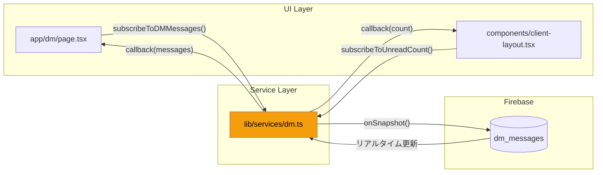
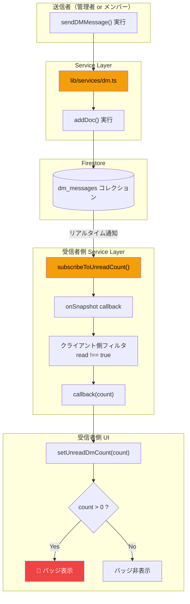
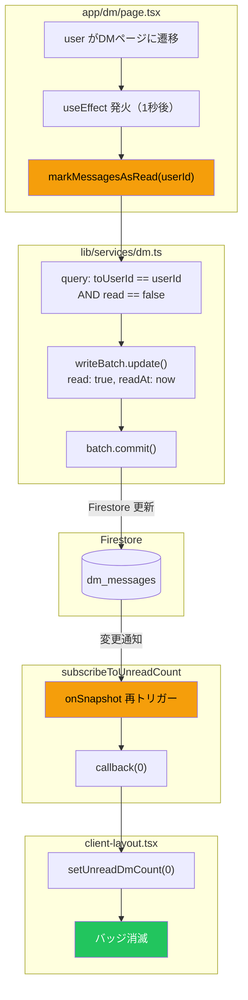
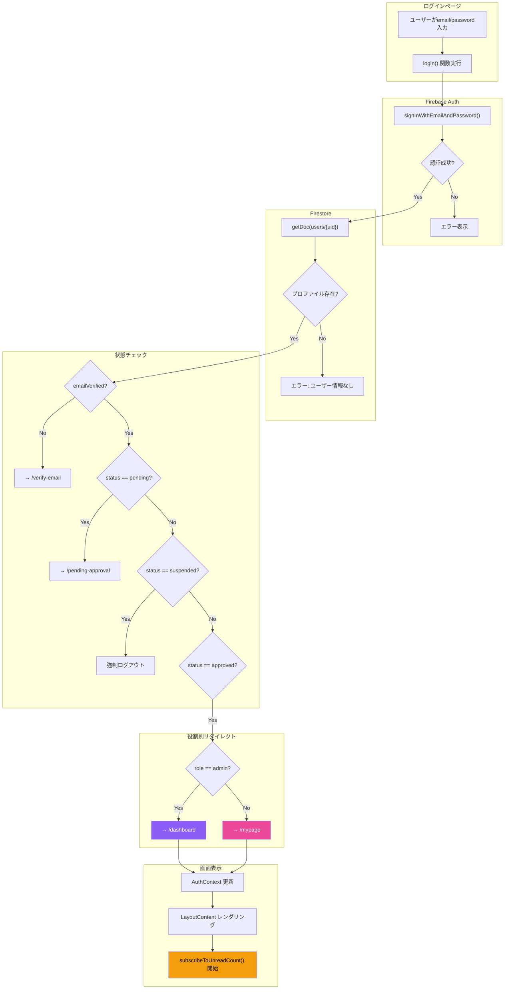

# CC Insight データフロー仕様書

> **ドキュメント更新日**: 2026-01-12  
> **生成方法**: ソースコードからの逆生成（リバースエンジニアリング）  
> **対象機能**: DM機能、認証（Auth）  
> **最終更新**: Phase 2 Service Layer リファクタリング完了後

---

## 1. Global State（グローバル状態管理）

### 1.1 使用している状態管理

| 技術 | 用途 | 定義ファイル |
|------|-----|-------------|
| **React Context** | 認証状態管理 | `lib/auth-context.tsx` |

> **注意**: Zustand, Redux, Jotai 等の外部状態管理ライブラリは**使用していません**。

### 1.2 AuthContext の構造

**定義場所**: `lib/auth-context.tsx` (47行目)

```typescript
interface AuthContextType {
  user: User | null;              // Firebase Auth ユーザー
  userProfile: UserProfile | null; // Firestore プロファイル
  loading: boolean;               // 読み込み中フラグ
  register: (...) => Promise<void>;
  login: (...) => Promise<void>;
  logout: () => Promise<void>;
  resendVerificationEmail: () => Promise<void>;
  refreshUserProfile: () => Promise<void>;
}
```

### 1.3 状態の伝播

```
ClientLayout
  └── AuthProvider           ← Context提供
        └── LayoutContent
              └── AuthGuard   ← 認証チェック
                    └── BottomNavigation
                          ├── unreadDmCount (ローカルState)
                          └── isDrawerOpen (ローカルState)
```

---

## 2. アーキテクチャパターン

### 2.1 UI → Service → Firestore パターン

Phase 2 リファクタリング後、UIコンポーネントはFirestoreに直接アクセスせず、**Service Layer**を経由してデータを取得・更新します。



### 2.2 旧アーキテクチャとの比較

| 項目 | Before (Phase 1以前) | After (Phase 2以降) |
|------|---------------------|---------------------|
| DMメッセージ取得 | `app/dm/page.tsx` で直接 `onSnapshot()` | `lib/services/dm.ts` の `subscribeToDMMessages()` |
| 未読バッジ監視 | `client-layout.tsx` で直接 `onSnapshot()` | `lib/services/dm.ts` の `subscribeToUnreadCount()` |
| メッセージ送信 | `addDoc()` を直接コール | `sendDMToAdmins()` / `sendAdminDMToUser()` |
| 既読処理 | `writeBatch()` を直接コール | `markMessagesAsRead()` |

---

## 3. Realtime Listeners（リアルタイム監視）

### 3.1 onSnapshot 使用箇所一覧（Phase 2以降）

| サービス関数 | コレクション | 呼び出し元 | 目的 |
|-------------|-------------|-----------|------|
| `subscribeToDMMessages()` | `dm_messages` | `app/dm/page.tsx` | 送受信メッセージ監視 |
| `subscribeToAdminDMWithUser()` | `dm_messages` | `app/admin/dm/page.tsx` | 管理者DM監視 |
| `subscribeToUnreadCount()` | `dm_messages` | `components/client-layout.tsx` | 未読バッジ監視 |
| `subscribeToReports()` | `reports` | ダッシュボード各ページ | 日報リアルタイム取得 |

### 3.2 DM未読バッジのリスナー詳細

**呼び出しコード** (`components/client-layout.tsx`):
```typescript
import { subscribeToUnreadCount } from "@/lib/services/dm";

useEffect(() => {
  const unsubscribe = subscribeToUnreadCount(userProfile.uid, (count) => {
    setUnreadDmCount(count);
  });
  return () => unsubscribe();
}, [userProfile?.uid]);
```

**サービス内部実装** (`lib/services/dm.ts`):
```typescript
export function subscribeToUnreadCount(
  userId: string,
  callback: (count: number) => void
): Unsubscribe {
  const q = query(
    collection(db, "dm_messages"),
    where("toUserId", "==", userId)
  );
  return onSnapshot(q, (snapshot) => {
    const unreadMessages = snapshot.docs.filter((doc) => {
      return doc.data().read !== true;
    });
    callback(unreadMessages.length);
  });
}
```

---

## 4. Logic Flow Diagrams

### 4.1 DM受信 → 未読バッジ点灯フロー（Service Layer版）



### 4.2 DM既読 → バッジクリアフロー（Service Layer版）



### 4.3 ログイン → 画面表示フロー



---

## 5. 状態更新のタイミング

### 5.1 AuthContext の更新トリガー

| トリガー | 更新される状態 | 発火タイミング |
|---------|--------------|--------------|
| `onAuthStateChanged` | `user`, `userProfile` | Firebase Auth 状態変更時 |
| `login()` | `userProfile` | ログイン成功後 |
| `logout()` | `user`, `userProfile` を null化 | ログアウト時 |
| `refreshUserProfile()` | `userProfile` | 手動更新時 |

### 5.2 DM未読カウントの更新トリガー

| トリガー | 経由サービス関数 | 更新される状態 |
|---------|----------------|--------------|
| 新規メッセージ受信 | `subscribeToUnreadCount()` | `unreadDmCount` |
| `markMessagesAsRead()` 実行 | `subscribeToUnreadCount()` | `unreadDmCount` → 0 |

---

## 6. データフロー図（全体像）

```mermaid
flowchart LR
    subgraph Browser["ブラウザ"]
        subgraph UI["UI Components"]
            dmPage["app/dm/page.tsx"]
            clientLayout["client-layout.tsx"]
            badge["🔴 未読バッジ"]
            chat["💬 チャット画面"]
        end

        subgraph Context["AuthContext"]
            user["user"]
            profile["userProfile"]
        end

        subgraph Local["ローカル State"]
            dmCount["unreadDmCount"]
            messages["messages[]"]
        end
    end

    subgraph ServiceLayer["Service Layer"]
        dmService["lib/services/dm.ts"]
    end

    subgraph Firebase["Firebase"]
        auth["Firebase Auth"]
        fs_users[("users")]
        fs_dm[("dm_messages")]
    end

    auth -->|onAuthStateChanged| user
    user --->|getDoc| fs_users
    fs_users -->|プロファイル| profile

    clientLayout -->|subscribeToUnreadCount| dmService
    dmPage -->|subscribeToDMMessages| dmService

    dmService <-->|onSnapshot| fs_dm

    dmService -->|callback(count)| dmCount
    dmService -->|callback(messages)| messages

    dmCount -->|count > 0| badge
    messages --> chat

    style dmService fill:#f59e0b,color:#000
    style badge fill:#ef4444,color:#fff
    style fs_dm fill:#4f46e5,color:#fff
```

---

## 7. Service Layer 関数一覧

### lib/services/dm.ts

| 関数 | 引数 | 戻り値 | 説明 |
|------|------|--------|------|
| `sendDMMessage` | `SendDMMessageParams` | `Promise<void>` | メッセージ送信 |
| `sendDMToAdmins` | `userId, userName, message` | `Promise<void>` | メンバー→運営DM |
| `sendAdminDMToUser` | `adminUid, adminName, targetId, targetName, message` | `Promise<void>` | 運営→メンバーDM |
| `subscribeToDMMessages` | `userId, callback` | `Unsubscribe` | DM監視（送受信両方） |
| `subscribeToUnreadCount` | `userId, callback` | `Unsubscribe` | 未読数監視 |
| `subscribeToAdminDMWithUser` | `adminUid, targetUserId, callback` | `Unsubscribe` | 管理者向けDM監視 |
| `markMessagesAsRead` | `userId` | `Promise<number>` | 既読処理 |
| `getAdminUIDs` | - | `Promise<string[]>` | 管理者UID取得 |

---

*このドキュメントは2026-01-12にPhase 2リファクタリング完了後に更新されました。*
