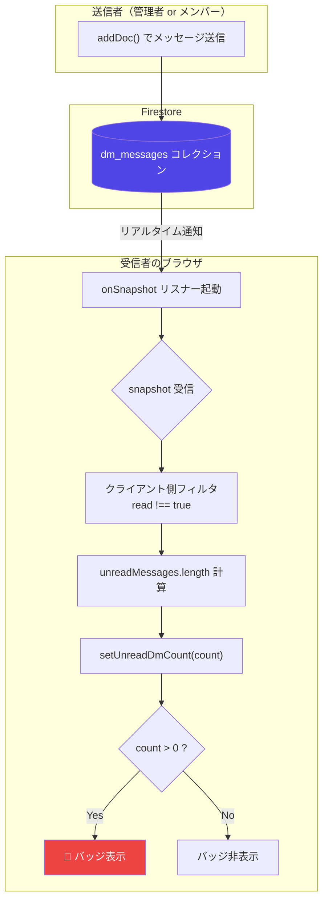
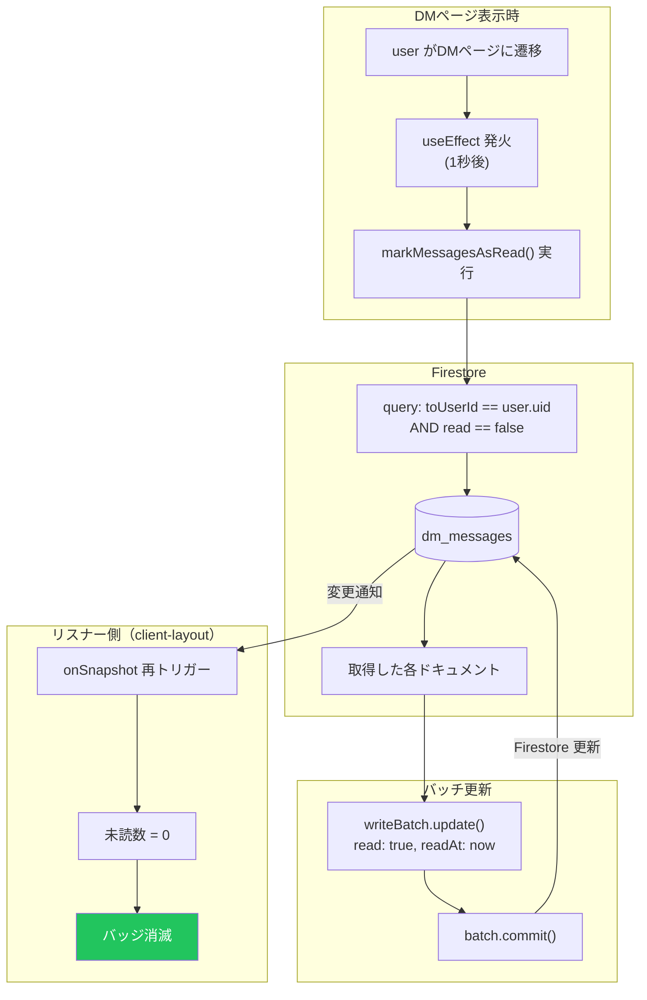
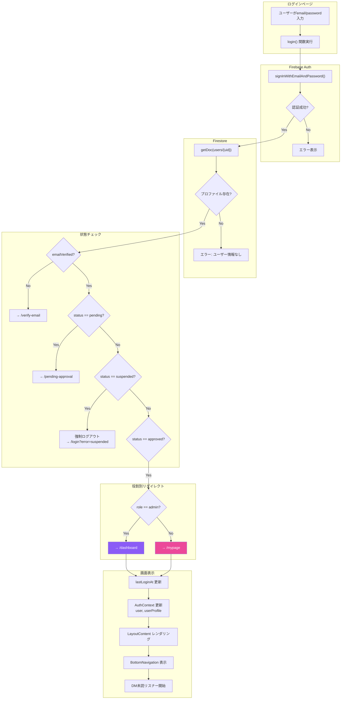
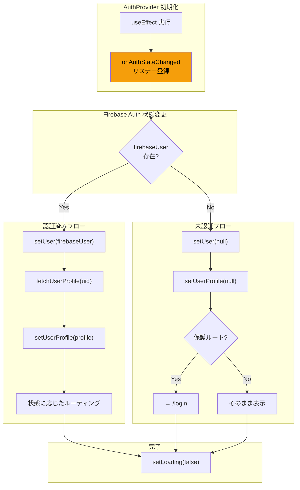
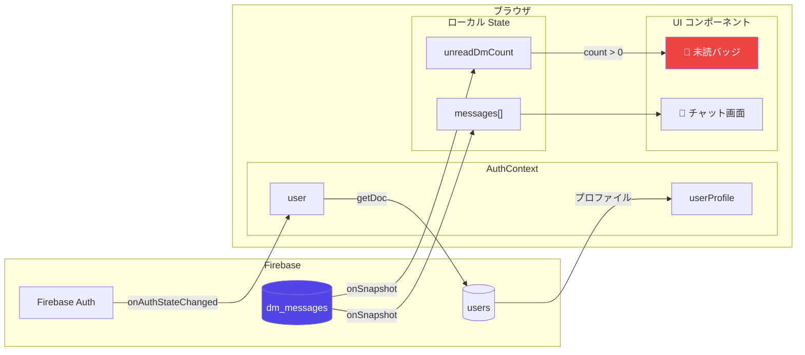

# CC Insight データフロー仕様書

> **ドキュメント生成日**: 2026-01-12  
> **生成方法**: ソースコードからの逆生成（リバースエンジニアリング）  
> **対象機能**: DM機能、認証（Auth）

---

## 1. Global State（グローバル状態管理）

### 1.1 使用している状態管理

| 技術 | 用途 | 定義ファイル |
|------|-----|-------------|
| **React Context** | 認証状態管理 | `lib/auth-context.tsx` |

> **注意**: Zustand, Redux, Jotai 等の外部状態管理ライブラリは**使用していません**。

### 1.2 AuthContext の構造

**定義場所**: `lib/auth-context.tsx` (47行目)

```typescript
interface AuthContextType {
  user: User | null;              // Firebase Auth ユーザー
  userProfile: UserProfile | null; // Firestore プロファイル
  loading: boolean;               // 読み込み中フラグ
  register: (...) => Promise<void>;
  login: (...) => Promise<void>;
  logout: () => Promise<void>;
  resendVerificationEmail: () => Promise<void>;
  refreshUserProfile: () => Promise<void>;
}
```

### 1.3 状態の伝播

```
ClientLayout
  └── AuthProvider           ← Context提供
        └── LayoutContent
              └── AuthGuard   ← 認証チェック
                    └── BottomNavigation
                          ├── unreadDmCount (ローカルState)
                          └── isDrawerOpen (ローカルState)
```

---

## 2. Realtime Listeners（リアルタイム監視）

### 2.1 onSnapshot 使用箇所一覧

| ファイル | 行 | コレクション | 目的 |
|---------|-----|-------------|------|
| `lib/firestore.ts` | 166 | `reports` | 日報リアルタイム取得 |
| `app/dm/page.tsx` | 96 | `dm_messages` | 受信メッセージ監視 |
| `app/dm/page.tsx` | 107 | `dm_messages` | 送信メッセージ監視 |
| `app/admin/dm/page.tsx` | 104 | `dm_messages` | 管理者DM監視 |
| `components/client-layout.tsx` | 329 | `dm_messages` | 未読バッジ監視 |

### 2.2 DM未読バッジのリスナー詳細

**定義場所**: `components/client-layout.tsx` (314-347行目)

```typescript
// クエリ: toUserId == userProfile.uid のメッセージを監視
const q = query(
  collection(db, "dm_messages"),
  where("toUserId", "==", userProfile.uid)
);

const unsubscribe = onSnapshot(q, (snapshot) => {
  // クライアント側フィルタリング（read !== true を未読とする）
  const unreadMessages = snapshot.docs.filter(doc => {
    const data = doc.data();
    return data.read !== true;
  });
  const count = unreadMessages.length;
  setUnreadDmCount(count);
});
```

> **⚠️ 技術的注意**: `where("read", "==", false)` はセキュリティルール違反のため、クライアント側フィルタリングを使用。

---

## 3. Logic Flow Diagrams

### 3.1 DM受信 → 未読バッジ点灯フロー



### 3.2 DM既読 → バッジクリアフロー



### 3.3 ログイン → 画面表示フロー



### 3.4 認証状態監視フロー（onAuthStateChanged）



---

## 4. 状態更新のタイミング

### 4.1 AuthContext の更新トリガー

| トリガー | 更新される状態 | 発火タイミング |
|---------|--------------|--------------|
| `onAuthStateChanged` | `user`, `userProfile` | Firebase Auth 状態変更時 |
| `login()` | `userProfile` | ログイン成功後 |
| `logout()` | `user`, `userProfile` を null化 | ログアウト時 |
| `refreshUserProfile()` | `userProfile` | 手動更新時 |

### 4.2 DM未読カウントの更新トリガー

| トリガー | 更新される状態 | 発火タイミング |
|---------|--------------|--------------|
| `onSnapshot` コールバック | `unreadDmCount` | dm_messages 変更時 |
| DMページで既読処理 | 間接的に `unreadDmCount` | batch.commit() 完了後 |

---

## 5. データフロー図（全体像）



---

*このドキュメントはソースコードから自動生成されました。*
